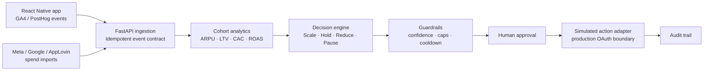

# GrossHacker AI — LTV & ARPU Tracker

Mobile growth intelligence that turns post-launch app telemetry into explainable marketing actions.

GrossHacker combines normalized purchase/session events with campaign spend, calculates cohort ARPU, projected LTV90, CAC, and ROAS, then produces guarded `Scale`, `Hold`, `Reduce`, or `Pause` decisions. The hackathon MVP executes those decisions against a simulated campaign budget and writes an audit trail; production ad-network writes are intentionally left behind an OAuth connector boundary.

## What works today

- Seeded 28-day workspace that runs without credentials
- Idempotent FastAPI endpoints for mobile events and campaign spend
- Cohort-level ARPU, LTV90 proxy, CAC, ROAS, retention, and attribution coverage
- Explainable recommendation engine with sample-size and data-quality checks
- Automation Center showing the full ingest → analyze → guardrail → activate path
- Human review modal, simulated budget execution, and activity audit log
- React dashboard with Overview, Cohorts, Automation, Data Sources, and Activity views
- Responsive layouts and offline sample-data fallback

## Metric contract

```text
Cohort ARPU     = cumulative attributed cohort revenue / attributed installs
CAC             = acquisition spend / attributed installs
ROAS            = cumulative attributed revenue / acquisition spend
Projected LTV90 = observed cohort ARPU × conservative maturity factor
LTV:CAC         = projected LTV90 / CAC
```

“ARPU lift” is presented as an observed association, not a causal claim. A real product would validate causality through controlled experiments.

## Architecture



## Run locally

Requirements: Python 3.9+, [uv](https://docs.astral.sh/uv/), and Node.js 20+.

Terminal 1:

```bash
cd backend
uv sync --extra dev
uv run uvicorn app.main:app --reload
```

Terminal 2:

```bash
cd frontend
npm install
npm run dev
```

Open [http://localhost:5173](http://localhost:5173). The web app uses the FastAPI service when available and clearly falls back to sample data when it is not.

## Verify

```bash
cd backend && uv run pytest -q
cd frontend && npm run build
```

## Event ingestion example

```bash
curl -X POST http://localhost:8000/api/events \
  -H 'Content-Type: application/json' \
  -d '{
    "event_id": "purchase-evt-001",
    "user_id": "app-user-42",
    "event_type": "purchase",
    "occurred_at": "2026-07-17T08:00:00Z",
    "campaign_id": "meta-pixel",
    "value_usd": 4.99,
    "platform": "ios"
  }'
```

Interactive API documentation is available at [http://localhost:8000/docs](http://localhost:8000/docs).

## Production path

The next implementation layer is intentionally explicit:

1. Replace the demo store with PostgreSQL and durable identity/attribution mappings.
2. Add signed webhook and batch import adapters for PostHog/GA4 and attribution providers.
3. Add OAuth action adapters for Meta Ads, Google Ads, and AppLovin.
4. Persist approval roles, spend ceilings, cooldowns, idempotency keys, and immutable audit records.
5. Calibrate the LTV90 forecast against mature cohorts and expose prediction intervals.

See [DESIGN.md](./DESIGN.md) for the product and interface contract and [DEVPOST.md](./DEVPOST.md) for submission-ready copy.
